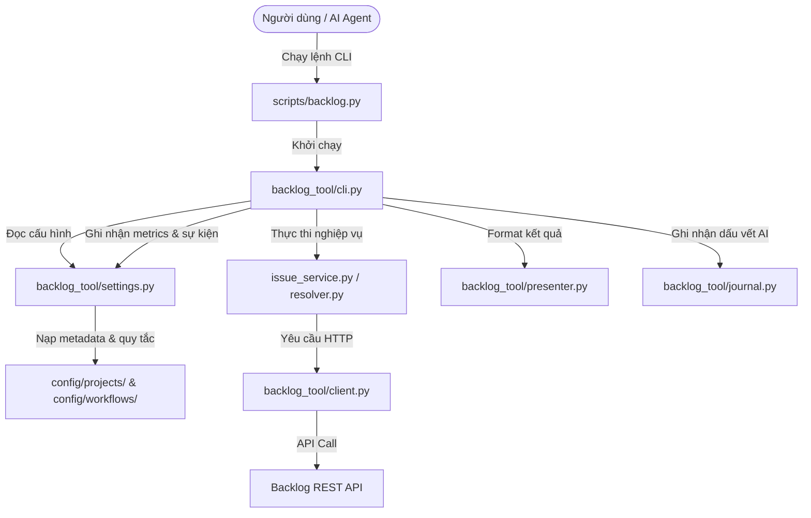

# Tài liệu Kiến trúc Backlog Skill

Tài liệu này mô tả chi tiết kiến trúc thiết kế, sơ đồ tổ chức thư mục, và các nguyên lý vận hành của skill `backlog` trong bộ công cụ `hieund-ai-kit`.

---

## 1. Tổng quan (Overview)

Skill `backlog` là một module đóng gói (self-contained) cho phép AI Agent hoặc nhà phát triển tương tác trực tiếp với API của dịch vụ Backlog (như quản lý dự án, xử lý issue, báo cáo lỗi, theo dõi deadline) thông qua giao diện dòng lệnh Python CLI. 

Mục tiêu thiết kế chính:
*   **An toàn dữ liệu (Safety-first)**: Mọi thao tác thay đổi dữ liệu mặc định chỉ là chạy thử nghiệm (dry-run) cho đến khi người dùng thêm cờ `--apply`.
*   **Hiệu năng tối ưu (Token-efficient)**: Cung cấp các presenter định dạng rút gọn (compact format) và các nhánh truy cập nhanh không cản trở (fast path) để giảm chi phí token tiêu thụ.
*   **Ghi log tập trung (Centralized Logging)**: Tất cả các dự án cài đặt sẽ tự động ghi dồn dữ liệu log về một vị trí tập trung duy nhất tại thư mục người dùng (`~/.hieund-ai-kit/backlog/logs/`).

---

## 2. Cấu trúc thư mục (Directory Structure)

```plaintext
backlog/
├── SKILL.md                 # Chỉ dẫn triggers & hướng dẫn nạp skill cho AI Agent
├── .gitignore               # Loại bỏ file nhạy cảm (.env, logs) khỏi git
├── .env.example             # File mẫu khai báo biến môi trường (BACKLOG_API_KEY)
├── scripts/
│   └── backlog.py           # Điểm chạy CLI (Entrypoint)
├── backlog_tool/            # Mã nguồn chính của CLI
│   ├── __init__.py
│   ├── cli.py               # Xử lý tham số CLI & định tuyến câu lệnh
│   ├── client.py            # HTTP Client kết nối Backlog API
│   ├── settings.py          # Quản lý cấu hình, nạp ENV, cơ chế log & metrics
│   ├── issue_service.py     # Nghiệp vụ xử lý Issue (CRUD)
│   ├── resolver.py          # Nghiệp vụ giải quyết lỗi (Resolve Bug workflow)
│   ├── presenter.py         # Định dạng dữ liệu hiển thị (Compact vs Full JSON)
│   └── journal.py           # Quản lý nhật ký tương tác AI (Session Traces)
├── config/                  # Tệp tin cấu hình và Metadata dự án
│   ├── backlog.json         # Cấu hình dự án mặc định
│   ├── projects/            # Danh mục ánh xạ ID cục bộ của từng dự án (AQM.json...)
│   └── workflows/           # Chính sách ràng buộc cho workflow (resolve_bug.json...)
├── references/              # Tài liệu tham khảo sâu
│   ├── architecture.md      # Tài liệu này
│   ├── cli.md               # Chi tiết danh sách câu lệnh
│   ├── workflows.md         # Quy chuẩn hoạt động của các workflow
│   └── session-trace.md     # Cách ghi chép trace AI
└── tests/                   # Các bài unit/integration test cục bộ
```

---

## 3. Các thành phần Core & Phân luồng dữ liệu



### 3.1 Giao diện CLI & Định tuyến (`cli.py`, `scripts/backlog.py`)
Tệp `scripts/backlog.py` là một wrapper mỏng thực hiện điều hướng đường dẫn để import module `backlog_tool.cli`. 
Module `cli.py` sử dụng thư viện `argparse` chuẩn của Python để tổ chức các nhóm lệnh:
*   `issue`: Thao tác CRUD chung.
*   `bug`: Các luồng công việc dành riêng cho lập trình viên (ví dụ: `list`, `resolve`, `create-ut`).
*   `config` & `project`: Quản lý môi trường và đồng bộ hóa siêu dữ liệu của dự án Backlog về máy cục bộ.
*   `story`: Cung cấp chế độ xem tổng quan về deadline.
*   `metrics` & `journal`: Đọc và phân tích lịch sử log phiên.

### 3.2 Kết nối & Cấu hình (`client.py`, `settings.py`)
*   `client.py` là một lớp API Client cơ bản gửi các truy vấn HTTPS REST. Nó tự động đính kèm `apiKey` lấy từ môi trường `BACKLOG_API_KEY` (hoặc thông qua tệp `.env`).
*   `settings.py` lưu trữ các đường dẫn thư mục và cung cấp chức năng dịch chuyển dữ liệu (data resolution). Nó phân giải các nhãn thân thiện mà người dùng nhập (như tên Category, tên trạng thái) thành các mã ID cụ thể trên hệ thống Backlog bằng cách tra cứu trong tệp danh mục của dự án (`config/projects/<PROJECT_KEY>.json`).

### 3.3 Nghiệp vụ dịch vụ (`issue_service.py`, `resolver.py`)
*   `issue_service.py` chứa các hàm cốt lõi để tương tác với API Backlog.
*   `resolver.py` quản lý các nghiệp vụ nâng cao như chuyển đổi trạng thái của bug thành `Closed` hoặc `Resolved`, phân bổ người sửa, kiểm tra xem các custom fields bắt buộc (ví dụ: `qc_activity`, `cause_category`) đã được điền đủ chưa theo quy định của dự án.

---

## 4. Hệ thống log tập trung & Xoay vòng file (Logging & Metrics Architecture)

Tất cả dữ liệu log được ghi dồn về một thư mục toàn cục tại máy cục bộ: `~/.hieund-ai-kit/backlog/logs/`. Kiến trúc log bao gồm 3 tệp tin chính:

### 4.1 Tầng Log sự kiện chung (`backlog.log`)
*   Được ghi tự động qua hàm `log_event()` trong `settings.py`.
*   Lưu trữ các mốc thời gian chạy câu lệnh, tham số gọi, lỗi hệ thống.
*   **Cơ chế bảo vệ**: Dữ liệu có độ dài lớn (ví dụ body phản hồi của API) tự động bị cắt ngắn ở mức tối đa 500 ký tự. Toàn bộ logic ghi được bọc trong khối `try-except` để tránh xảy ra lỗi phân quyền gây sập CLI.

### 4.2 Tầng Thống kê hiệu năng và Token (`metrics.log`)
*   Được ghi tự động sau mỗi lần kết thúc chạy lệnh CLI qua hàm `log_metric()`.
*   **Phân tích chi phí**: Ghi nhận kích thước byte kết quả trả về (`outputBytes`) và tính toán số lượng token ước tính (`estimatedTokens` = `outputBytes / 4`) để giúp theo dõi chi phí hoạt động chung trên tất cả các dự án.

### 4.3 Tầng Nhật ký phiên làm việc (`sessions/`)
*   Được quản lý bởi `journal.py` dưới định dạng JSON Lines (`.jsonl`).
*   Các tệp log phiên sẽ được ghi phẳng trực tiếp dưới thư mục `sessions/` theo định dạng `<YYYY-MM-DD>_<command>.jsonl`.
*   Mỗi bản ghi log vẫn lưu trường thông tin `"project"` để nhà phát triển có thể lọc hoặc truy vết theo dự án đích khi cần thiết.

### 4.4 Cơ chế xoay vòng file log tự động (Log Rotation)
Cả hai file log tích lũy vô hạn là `backlog.log` và `metrics.log` đều được bảo vệ bởi cơ chế xoay vòng `rotate_file_if_needed`:
*   Giới hạn dung lượng mỗi tập tin log tối đa là **5MB**.
*   Khi vượt quá giới hạn, hệ thống tự động lưu trữ tối đa **3 file backup** (`.log.1`, `.log.2`, `.log.3`). Các log session cũ hơn được giữ nguyên độc lập không bị xoay vòng.

---

## 5. Đồng bộ hóa đa dự án (Multi-project Sync)

Vì `hieund-ai-kit-cli` là một bộ công cụ phân phối (kit), skill `backlog` được lưu trữ tập trung tại thư mục `shared/runtime/.agents/skills/backlog` trong kho mã nguồn chính. 

Khi nhà phát triển thay đổi mã nguồn, họ chỉ cần cập nhật mã nguồn ở khu vực `shared` và chạy:
```bash
npm run sync:shared-runtime
```
Hệ thống sẽ tự động đồng bộ hóa các thay đổi mã nguồn mới nhất vào layout cài đặt mẫu unified (`templates/`) trước khi phân phối tới các dự án đích của khách hàng.
